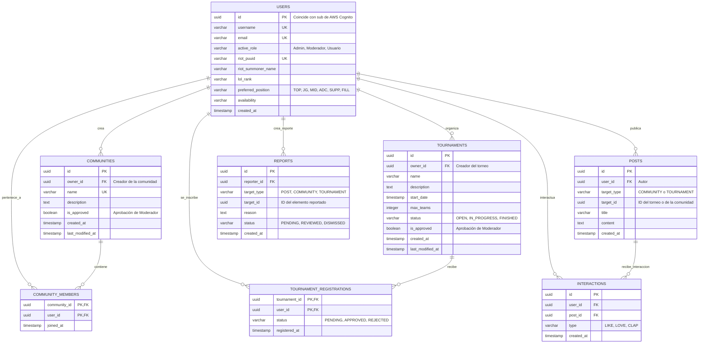

# Modelo de Datos - ZabEsports

Este documento describe la estructura y diseño de la base de datos relacional para **ZabEsports**, utilizando **PostgreSQL** y siguiendo los principios de consistencia transaccional y diseño cloud-native.

## 📊 Diagrama Entidad-Relación (ER)

El siguiente diagrama representa gráficamente las entidades, sus atributos clave y las relaciones con sus respectivas cardinalidades.

---

## 🗂️ Descripción Detallada de Entidades y Atributos

### 1. `USERS` (Usuarios)
Almacena el perfil y metadatos de los usuarios. La contraseña no se almacena localmente ya que la autenticación es externa (Amazon Cognito).
* `id` (UUID, PK): Identificador único que se mapea directamente con el identificador `sub` retornado por Amazon Cognito.
* `username` (VARCHAR, Único): Nombre de usuario visible en la plataforma.
* `email` (VARCHAR, Único): Correo electrónico del usuario.
* `active_role` (VARCHAR): Rol del usuario en el sistema (`'Admin'`, `'Moderador'`, `'Usuario'`).
* `riot_puuid` (VARCHAR, Único, Nullable): ID único de Riot Games obtenido mediante la API oficial para verificar estadísticas de forma automatizada.
* `riot_summoner_name` (VARCHAR, Nullable): Nombre del invocador del usuario en League of Legends.
* `lol_rank` (VARCHAR, Nullable): Rango del usuario en League of Legends (ej. Gold, Platinum, Diamond).
* `preferred_position` (VARCHAR, Nullable): Rol principal en League of Legends (TOP, JUNGLE, MID, ADC, SUPPORT, FILL).
* `availability` (VARCHAR, Nullable): Horarios disponibles para entrenar o competir.

### 2. `COMMUNITIES` (Comunidades)
Comunidades amateur creadas por usuarios finales para congregar jugadores y compartir contenido.
* `owner_id` (UUID, FK): Referencia al usuario creador y administrador de la comunidad.
* `is_approved` (BOOLEAN): Control de aprobación. Por defecto es `FALSE` y requiere la intervención de un moderador para activarse.
* `last_modified_at` (TIMESTAMP): Registro del momento de la última modificación para auditorías.

### 3. `COMMUNITY_MEMBERS` (Miembros de Comunidad)
Tabla intermedia Many-to-Many que registra qué usuarios pertenecen a qué comunidades.

### 4. `TOURNAMENTS` (Torneos)
Torneos competitivos publicados en la plataforma.
* `owner_id` (UUID, FK): Referencia al usuario organizador del torneo.
* `max_teams` (INTEGER): Límite máximo de participantes.
* `status` (VARCHAR): Estado de progreso del torneo (`'OPEN'`, `'IN_PROGRESS'`, `'FINISHED'`).
* `is_approved` (BOOLEAN): Control de aprobación. Por defecto es `FALSE` y requiere la intervención de un moderador.
* `last_modified_at` (TIMESTAMP): Registro de la última modificación del torneo para auditorías de estado.

### 5. `TOURNAMENT_REGISTRATIONS` (Inscripciones a Torneo)
Tabla intermedia Many-to-Many que registra las inscripciones de jugadores en los torneos.
* `status` (VARCHAR): Estado de la inscripción (`'PENDING'`, `'APPROVED'`, `'REJECTED'`).

### 6. `POSTS` (Publicaciones)
Contenido creado dentro de las comunidades y torneos.
* `target_type` (VARCHAR): Indica si la publicación pertenece a una comunidad o torneo (`'COMMUNITY'`, `'TOURNAMENT'`).
* `target_id` (UUID): ID correspondiente del torneo o de la comunidad.

### 7. `INTERACTIONS` (Interacciones)
Interacciones que los usuarios pueden realizar con las publicaciones (Likes/Reacciones).
* `type` (VARCHAR): Tipo de interacción (ej. `'LIKE'`).

### 8. `REPORTS` (Reportes)
Registro de reportes generados por usuarios sobre publicaciones, comunidades o torneos ofensivos o inapropiados.
* `reporter_id` (UUID, FK): El usuario que realiza la denuncia.
* `target_type` (VARCHAR): Tipo del elemento denunciado (`'POST'`, `'COMMUNITY'`, `'TOURNAMENT'`).
* `target_id` (UUID): ID del elemento denunciado.
* `status` (VARCHAR): Estado del reporte (`'PENDING'`, `'REVIEWED'`, `'DISMISSED'`).
