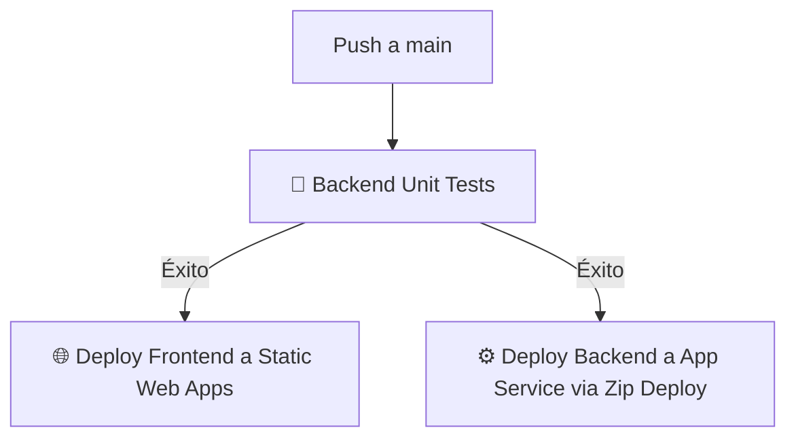

# ZabEsports — Documentación de Despliegue e Infraestructura Cloud (Semana 6)
**Desarrollado para:** José Sepúlveda
**Grupo 10 | Taller de Desarrollo de Software**

---

## ☁️ Arquitectura 100% en la Nube (Microsoft Azure)

El sistema ha sido migrado por completo de un entorno local de contenedores a servicios administrados de alta disponibilidad en **Microsoft Azure**, cumpliendo a cabalidad con la directiva del docente:

1. **Frontend:** Servido mediante **Azure Static Web Apps**.
2. **Backend (API REST):** Alojado en **Azure App Service (Node.js)** bajo un plan gratuito F1.
3. **Base de Datos:** Motor **Azure Database for PostgreSQL (Flexible Server)**.

---

## 🛠️ Detalle de los Recursos Desplegados

### 1. Base de Datos PostgreSQL Cloud
- **Servidor:** `zabesports-db-cloud.postgres.database.azure.com`
- **Base de datos:** `zabesports`
- **Puerto:** `5432`
- **Usuario administrador:** `zjoseadmin`
- **Método de Autenticación:** Autenticación Nativa PostgreSQL + SSL Requerido (`sslmode=require`).
- **Esquema de Tablas:** 8 tablas relacionales con restricciones e integridad referencial (`users`, `communities`, `community_members`, `tournaments`, `tournament_registrations`, `posts`, `interactions`, `reports`) y datos semilla inyectados.

### 2. Backend API REST (Node.js + Express)
- **URL Pública:** `https://zabesports-api-aje2efc6adawfyh0.eastus2-01.azurewebsites.net`
- **Configuración de Variables de Entorno en Azure:**
  - `DATABASE_URL`: Cadena de conexión segura al servidor PostgreSQL Cloud.
  - `JWT_SECRET`: Llave criptográfica para firmas criptográficas de tokens de autenticación.
  - `NODE_ENV`: Establecido en `production` para optimizaciones de rendimiento.

---

## 🚀 Integración Continua y Despliegue Continuo (CI/CD)

El repositorio cuenta con un pipeline automatizado implementado en **GitHub Actions** (`.github/workflows/azure-static-web-apps-polite-mud-0a1c8430f.yml`) con 3 fases secuenciales gatilladas con cada push a la rama `main`:

### 📋 Pruebas Unitarias Integradas (17/17 en Verde)
El pipeline ejecuta las pruebas unitarias automatizadas con Jest y Supertest en cada integración.
- **Módulo de Autenticación (`auth.test.ts`):** Cobertura de registro de usuarios, hashing de contraseñas con bcrypt, prevención de correos duplicados y login generando tokens JWT estructurados.
- **Módulo de Comunidades (`communities.test.ts`):** Validación de creación de comunidades y restricciones de control de acceso basadas en roles (`usuario`, `moderador`, `admin`).

---

## 🔐 Credenciales de Prueba para la Demo del Docente

El sistema cuenta con tres perfiles preestablecidos en la base de datos de producción para validar la funcionalidad multi-rol y la autenticación JWT:

| Usuario | Email | Contraseña | Rol |
|---|---|---|---|
| **José Sepúlveda** (Admin) | `jose@zabesports.cl` | `password123` | **admin** |
| **ZabPlayer** (Moderador) | `zab@zabesports.cl` | `password123` | **moderador** |
| **knghtfyre** (Usuario Final) | `knghtfyre@correo.com` | `password123` | **usuario** |

---

## 📌 Guía de Verificación Rápida

- **Endpoint de Salud de la API (Health Check):** `https://zabesports-api-aje2efc6adawfyh0.eastus2-01.azurewebsites.net/api/health`
- **Acceso al Portal Web (Frontend):** Puedes ingresar al enlace de tu **Azure Static Web App (ZabEsports-Web)**, loguearte con las credenciales de arriba y validar la carga en tiempo real desde la base de datos cloud de Azure.
