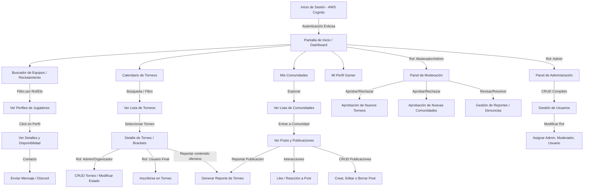

# Diseño del Producto - ZabEsports

Este documento detalla el diseño de la interfaz de usuario (UI), la experiencia de usuario (UX) y el flujo de navegación de la aplicación **ZabEsports**.

---

## 🗺️ Mapa de Navegación (Flujo del Usuario)

El siguiente diagrama de flujo representa el recorrido del usuario desde que inicia sesión hasta que interactúa con las principales funciones del sistema.

---

## 🖥️ Descripción de Pantallas Principales

1. **Pantalla de Inicio de Sesión (Login):**
   * **Propósito:** Autenticar a los usuarios a través del Identity Service.
   * **Elementos:** Logo de ZabEsports, formulario minimalista de correo/usuario, botones grandes de inicio de sesión único (Single Sign-On - SSO) integrados con **AWS Cognito** y **Discord** (proveedores federados).
2. **Pantalla de Inicio (Dashboard/Feed):**
   * **Propósito:** Panel central con el feed social y las novedades competitivas.
   * **Elementos:** Barra lateral izquierda de navegación rápida, sección central con el feed de publicaciones destacadas de las comunidades suscritas, y una barra lateral derecha que muestra torneos activos y sugerencias de reclutamiento.
3. **Módulo de Reclutamiento (Buscador):**
   * **Propósito:** Emparejar jugadores libres con escuadras en formación.
   * **Elementos:** Filtros interactivos por Rol (Top, Jungle, Mid, ADC, Support), Rango (Hierro a Retador) y disponibilidad horaria. Los resultados se muestran como "tarjetas de jugador" (Player Cards) que incluyen estadísticas vinculadas en tiempo real mediante la API de Riot Games.
4. **Detalle e Inscripción de Torneos:**
   * **Propósito:** Visualizar los detalles, fechas y brackets del torneo seleccionado.
   * **Elementos:** Sección informativa (fechas, cupos, reglas), visualización gráfica del árbol de llaves (brackets) y el botón de acción principal para inscribirse o salir del torneo.

---

## 🖱️ Interacciones y Funcionalidades Especiales

* **Filtros Dinámicos en Tiempo Real:** En los módulos de Torneos y Reclutamiento, las búsquedas operan sin refrescar la página, aplicando filtros directos al listado (Reactivo).
* **Confirmación por Pasos:** La inscripción a torneos requiere confirmar la alineación de la escuadra mediante una ventana modal interactiva para mitigar errores de registro.
* **Sistema de Reportes Contextual:** Al hacer clic en el botón de opciones en cualquier publicación, comunidad o torneo de terceros, se despliega un formulario flotante para clasificar y justificar la denuncia.

---

## ♿ Accesibilidad (a11y) y Usabilidad (u17y)

* **Contrastes de Color:** La interfaz utiliza una paleta de colores oscuros (Dark Theme gamer) con acentos de color cian neón y oro. Los colores se han seleccionado cumpliendo las pautas WCAG 2.1 AA, garantizando una relación de contraste mínima de 4.5:1 para elementos de texto.
* **Accesibilidad por Teclado:** Todos los componentes interactivos (botones, formularios, enlaces) son accesibles y operables vía teclado (`Tab`, `Enter`, `Space`) con bordes de enfoque (focus indicators) altamente visibles.
* **Diseño Responsivo:** Diseñado mediante enfoque *Mobile-First*, garantizando que las interfaces de visualización de llaves de torneos y perfiles de jugadores se adapten sin pérdida de información desde smartphones hasta pantallas de escritorio de alta resolución.
